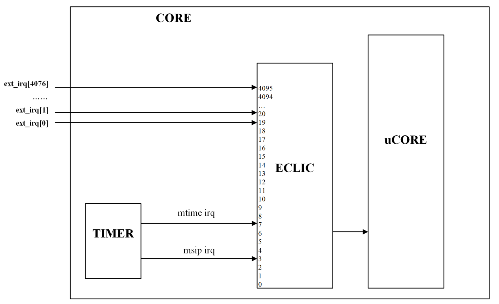

= Как поморгать светодиодом на RISC-V с нуля (на примере GD32VG103 и IAR C++)

Сегодня речь пойдет о модном - о RISС-V микроконтроллере. Я давно хотел познакомится с этим ядром и ждал когда появится что-то похожее на STM32 и вот дождался, встречайте - китайский GigaDevice - GD32V.

Инфраструктура для этого микроконтроллера не такая обширная как для STM32, но есть вне необходмое для того, чтобы начать с ним работать. Благо отладочные платы платы можно заказать на аликекспресс, например, вот тут: https://aliexpress.ru/item/4000818117666.html?spm=a2g0o.productlist.0.0.2be84b44vp828j&algo_pvid=5c19832a-a46c-46b7-be3b-3d95f853fe3e&algo_expid=5c19832a-a46c-46b7-be3b-3d95f853fe3e-0&btsid=0b8b035915947830320443821e3494&ws_ab_test=searchweb0_0,searchweb201602_,searchweb201603_[Longan Nano GD32VF103CBT6 RISC-V MCU]

Китайцы продвигают для этого микроконтроллера среду разработку Platform IO, которую можно поставить как Plugin под Visual Studio Code. Но это как то не по инженерным понятиям, мы же инжерены и хотим разобраться сами с нуля, поэтому давайте попробуем запустить плату на IAR, написав все сами с нуля.

Кстати, IAR раздает отладочный комплект (отладочная плата + отладчик I-JET + 30 Дней полная лицензия) IAR RISC-V GD32V Evaluation kit. Вот тут можно оставить заявку https://www.iar.com/rfq/[Request for Development Tools]. Не уверен, что посылает всем желающим, но нам прислал. Спасибо им за это.

Ну что же, кто заинтересовал, добро пожаловать под кат

== Введение
Вообще я хотел портировать очень просто планировщик из статьи https://habr.com/ru/post/506414/[Переключение контекста и простой вытесняющий планировщик для CortexM], но из-за найденной мною ошибки в компиляторе IAR - на прямую этого сделать не удалось, пришлось немного переделать стратегию определения задач, но и вообще материала получалось много.
Да и вообще когда я только сел разбираться, думал, что разберусь за пару часов, но открыв документацию, которая иногда противоречива, понял, что парой часов тут не обойтись и  первое впечатление от RISC-V было вот прямо как у Джерими.

Но чуть позже я привык и даже проникся, а потому попытаюсь донести, что же я понял, и что такое китайский RISC-V.

Нет смысла описывать все детали архитектуры RISC-V, я ограничусь только необходимым минимумом для того, чтобы понять, как работает микроконтроллер GD32VF103 и как правильно поморгать светодиодом.
Материала по RISCV на русском не так много (вот есть обзор https://visuale-ru.turbopages.org/s/visuale.ru/blog/sozdanie-protsessora-so-svobodnaya-arkhitekturoj-risc-v-chast-1[Создание процессора со свободной архитектурой RISC-V]), поэтому, как обычно, начнем с азов. Итак, поехали.

=== Какая поддержка уже существует у GD32VF103

1. Описание ISA RISC-V с официального сайта risc-v организации:
** https://riscv.org/specifications/isa-spec-pdf/[Непривилегированная ISA]
** https://riscv.org/specifications/privileged-isa/[Прилегированная ISA]

2. Ядро микроконтроллера сделано на ядре https://github.com/nucleisys/Bumblebee_Core_Doc/blob/master/Bumblebee%20Core%20Architecture%20Manual.pdf[Bumblebee], которое в свою очередь использует архитектуру https://doc.nucleisys.com/nuclei_spec/isa/introduction.html[Nuclei processor core].

3. Есть общие библиотеки ядра Nucleo RISC-V на Си, например можно посмотреть https://github
.com/IARSystems/iar-risc-v-gd32v-eval/tree/master/Firmware/RISCV[здесь в репозитарии IAR]
или тут в оригинале https://github.com/nucleisys/n200-sdk/tree/master/bsp/nuclei-n200/n200/drivers[n200 drivers]

4. Есть библиотека периферии от самой GigaByte, например можно взять https://github.com/IARSystems/iar-risc-v-gd32v-eval/tree/master/Firmware[тут же в репозитарии IAR] или на сайте производителя https://www.gigadevice.com/firmware/gd32vf103xxxx-firmware-library/[Библиотека от производителя]

5. Так же есть порты операционных систем FreeRTOS и uCOS II https://github.com/nucleisys/n200-sdk/tree/master/software[n200 sdk]

Но, мы попробуем написать код на С++ без всех этих библиотек - все с нуля, пользуясь только документацией. Задача будет такая:

*Моргать двумя светодиодами от раз в 100 и 200мс от прерывания таймера.*

== Немного определений
RISC-V это уникальная архитектура, поэтому все определения и понятия тут свои, основные понятия, которые будут постоянно встречаться на сложном пути изучения RISC-V, я приведу ниже

* Аппаратный поток(hart) - архитектура поддерживает многопоточность, поэтому может быть несколько потоков исполнения кода. Под потоком (hart) подразумевается аппаратные потоки. Микроконтроллер как миниму должен иметь один поток (hart) с ID равным 0.
* Trap - ловушка или обработчик. Ловушки бывают нескольких типов.
** Ловушка исключения (exception) - собственно как и в CortecM архитектуре - это понятие означает синхронное событие, которое прерывает исполнения кода. Исключение может прерываться другим исключением, или NMI.
** Ловушка прерывания (interrupt) - внешнее асинхронное событие, которое может привести к тому, что поток неожиданно может передать управление. Прерывание может прерываться другим прерыванием, NMI, или исключением.
** Ловушка NMI -  немаскируемое прерывание. NMI не может прерываться другим NMI, но может перейти из обработчика NMI в режим обработки исключения, если в момент обработки NMI произойдет исключение. В нашем микроконтроллере, например, отказ высокоскоростного кварцевого генератора, заведен на немаскируемое прерывание.
* Машинный режим - самый высокоприоритетный режим, который должны поддерживать всеми RISC-V ядрами. Соответственно, все что связано со словом машинный должно поддерживается на уровне ядра.

== Архитектуры RISC-V

Для начала, немного википедии:

> RISC-V (риск-пять) — открытая и свободная система команд (ISA — Instruction Set Architecture) и процессорная архитектура на основе концепции RISC для микропроцессоров и микроконтроллеров. Спецификация доступна для свободного и бесплатного использования, включая коммерческие реализации непосредственно в кремнии или конфигурировании ПЛИС. Имеет встроенные возможности для расширения списка команд и подходит для широкого круга применений.

На данный момент, в архитектуре разделяются следующие наборы команд:
|===
|Сокращение |Наименование |Версия |Статус

|Базовые наборы
|
|
|

|RV32I
|32-битный базовый набор с целочисленными операциями с 32 регистрами общего назначения
|2.1
|Ratified

|RV32E
|32-битный базовый набор с целочисленными операциями для встраиваемых систем с 16 регистрами общего назначения
|1.9
|Draft

|RV64I
|64-битный базовый набор с целочисленными операциями с 32 регистрами общего назначения
|2.1
|Ratified

|RV128I
|128-битный базовый набор с целочисленными операциями
|1.7
|Draft

|Стандартные расширеные наборы
|
|
|

|M
|Целочисленное умножение и деление (Integer Multiplication and Division)
|2.0
|Ratified

|A
|Атомарные операции (Atomic Instructions)
|2.1
|Ratified

|F
|Арифметические операции с плавающей запятой над числами одинарной точности (Single-Precision Floating-Point)
|2.2
|Ratified

|D
|Арифметические операции с плавающей запятой над числами двойной точности (Double-Precision Floating-Point)
|2.2
|Ratified

|G
|Сокращеное обозначение для комплекта из базового и стандартного наборов команд
|н/д
|н/д

|Q
|Арифметические операции с плавающей запятой над числами четвертной точности
|2.2
|Ratified

|L
|Арифметические операции над числами с фиксированной запятой (Decimal Floating-Point)
|0.0
|Open

|C
|Сокращённые имена для команд (Compressed Instructions)
|2.2
|Ratified

|B
|Битовые операции (Bit Manipulation)
|0.36
|Open

|J
|Двоичная трансляция и поддержка динамической компиляции (Dynamically Translated Languages)
|0.0
|Open

|T
|Транзакционная память (Transactional Memory)
|0.0
|Open

|P
|Короткие SIMD-операции (Packed-SIMD Instructions)
|0.1
|Open

|V
|Векторные расширения (Vector Operations)
|0.2
|Open

|N
|Инструкции прерывания (User-Level Interrupts)
|1.1
|Open

|===

Табличка из википедии  довольно здоровая. На самом деле для микроконтроллеров общего назначения используется в основном 32 битная архитектура с небольшим количеством расширений, например:

Ядро:

* РВ32Е: архитектура 32бит с 16 регистрами общего назначения
* Архитектура RV32I: 32bits с 32 регистрами общего назначения

Расширения:

* M: целочисленные инструкции по умножению и делению
* C: сжатые до 16 бит инструкции для уменьшения размера кода
* А: Атомарные Инструкции
* F: Инструкции С Плавающей Запятой Одиночной Точности
* D: Инструкции С Плавающей Запятой Двойной Точности

== Наборы инструкций
Существует две спецификации набора инструкций:

1. Непривилегированный набор инструкций
2. Привилегированный набор инструкций

В микроконтроллере используется оба набора.

=== Непривилегированный набор инструкций

Спецификация на этот набор описывает архитектуру, т.е. инструкции и функциональность которые обычно используются во всех режимах привилегий, т.е. общие для всех архитектур набор инструкций и функций. Спецификация на этот набор доступна здесь: https://riscv.org/specifications/isa-spec-pdf/[Непривилегированный ISA]

=== Привилегированный набор инструкций
Пара слов и привилегированной архитектуре. Основное её назначение - это разделение уровня приложений и уровня ядра, а также поддержка операционных систем в плоть до нескольких разных операционных систем типа Linux, работающих через виртуальную машину.

Но нас это не особо беспокоит, у нас небольшой микроконтроллер, который из всего этого дела использует самую простую форму привилегированности

Спецификация на привилегированный набор описывает возможную архитектуру привилегированных режимов, в том числе специальные инструкции и дополнительную функциональность для этого режима. Спецификация доступна здесь: https://riscv.org/specifications/privileged-isa[Привилегированная ISA]

Следует уточнить, что эта спецификация носит рекомендованный характер, и она описывает только одно из возможных решений. Основное её преимущество, в том, что привилегированная архитектура никак не задевает основную непривилегированную функциональность и является расширением.

=== Регистры общего назначения
RISC-V имеет 32 регистра x0-x31. Но обычно к ним обращаются через ABI имена.

Рабочие регистры::

Регистры t0-t6(x5-x7, x28-x31) и a0-a7(x10-x11, x12-x17), а также регистр адреса возврата являются рабочими регистрами. Любая функция может изменять содержимое этих регистров и если ей нужно воспользоваться какими-то из этих регистров после вызова другой функции, она должна сохранить их значение на стеке.

Сохраняемы регистры::
Регистры s0-s11 (x8, x9, x18-x27 ) должны сохраняться вызываемой функцией на стеке (если функция хочет их использовать) перед входом в функцию и восстанавливаться перед выходом, .

Далее табличка из интернета, описывающая каждый регистр, не стал переводить, и так все понятно:

|===
|Register |ABI Name |Description |Saver

|x0
|zero
|Hard-wired zero
|—

|x1
|ra
|Return address
|Caller

|x2
|sp
|Stack pointer
|Callee

|x3
|gp
|Global pointer
|—

|x4
|tp
|Thread pointer
|—

|x5
|t0
|Temporary/alternate link register
|Caller

|x6–7
|t1–2
|Temporaries
|Caller

|x8
|s0/fp
|Saved register/frame pointer
|Callee

|x9
|s1
|Saved register
|Callee

|x10–11
|a0–1
|Function arguments/return values
|Caller

|x12–17
|a2–7
|Function arguments
|Caller

|x18–27
|s2–11
|Saved registers
|Callee

|x28–31
|t3–6
|Temporaries
|Caller

|pc
|pc
|Program counter
|

|===

А вот теперь моя вольная интерпретация регистров.

x0/zero::
Регистр хранит всегда 0 и может использоваться в некоторых командах доступа к регистрам CSR, например, в команде CSRRS (Atomic Read and Set Bits in CSR), при использовании регистра x0 как источника маски, команда будет атомарно только читать CSR регистр без его модификации, если вы захотите использовать другой регистр в котором хранится ноль, то команда все равно произведет запись в регистр CSR, поэтому если хотите только прочитать биты, то нужно использовать zero.
.

x1/ra::
(Link register или Return Address регистр). Регистр содержащий адрес возврата из функции. Этот регистр может использоваться как рабочий регистр в функции, поэтому при входе в функцию он должен быть сохранен, а при выходе, перед вызовом инструкции ret, восстановлен.

x2/sp::
Указатель стека.

x3/gp::
(The global pointer register). Глобальный регистр указателей (gp/x3) используется для эффективного доступа к памяти в пределах области в 4 Кбайта.

Компоновщик сравнивает значение адресов памяти со значением которым должен быть проинициализирован gp, и если оно находится в пределах диапазона 4 кбайта, заменяет абсолютную/pc-относительную адресацию на gp-относительную адресацию, что делает код более эффективным. Этот процесс также называется короткой памятью.

Область 4K может находиться в любом месте памяти, но для того, чтобы оптимизация была эффективной, она должна предпочтительно охватывать наиболее интенсивно используемую область оперативной памяти. Поэтому обычно в настройках компоновщика для инициализации этого указателя используют адрес на начало сегмента глобальных и статических данных.

x4/tp::
(The thread pointer). Указатель потока. Этот регистр используется для реализации механизма Локального хранилища потока (Thread Local Storage (TLS)), например при реализации спецификатора класса thread_local в С++.

=== Уровни привилегий
В RISCV архитектуре существует 3 уровня привилегий. Уровни привилегий используются для обеспечения защиты между различными компонентами программного обеспечения (например, пользовательским приложением и ядром операционной системы). Любые попытки выполнения операций, не разрешенных текущим режимом привилегий, вызовут исключение.
Ниже показаны значения режима привилегий:

|===
|Уровень |Код режима |Имя |Сокращенное название| Описание

|0
|00
|User/Application
|U
|Самый низкий уровень привилегий

|1
|01
|Supervisor
|S

|2
|10
|Reserved
|

|3
|11
|Machine
|M
|Самый высокий уровень привилегий

|===

|===
|Поддерживаемые режимы |Предполагаемое использование

|M
|Системы со встроенным ПО

|M, U
|Защищенноые системы со встроенным ПО и операционными системами реального времени

|M,S,U
|Системы с Unix подобными операционными системами

|===

Как видно, для микроконтроллеров, таких как GD32VF103 рекомендованы режимы M и U. В данном случае, если микроконтроллер работает в режиме пользовательский режим U, то ему не доступны настройки и доступ к регистрам ядра, например, таким как mtvt, mepc... о них немного ниже речь пойдет. И чтобы обратиться к ним, вам необходимо зайти в ловушку. Т.е. любое прерывание машинного уровня переводит ядро в машинный режим M и уже внутри него можно обращаться к машинным регистрам. В общем случае алгоритм доступа к машинным регистрам из пользовательского режима выглядит следующим образом - *вам надо вызывать инструкцию ecall запрос среды исполнения, которая собственно переведт микроконтроллер в машинный режим и вызовет обработчик ловушки, в котором вы можете поменять машинные регистры в соотвествии с запросом*.
*Переход же из машинного режима в пользовательский происходит после команды mret. Точнее она переходит в тот режим, который укзана в другом регистре*

Забегая вперед скажу, что хотя микроконтроллер и поддерживает два режима, после сбора он находится в машинном режиме, и переводить в пользовательский режим мы его не будет, чтобы не нагружать статью.

== Режимы Привилегий
Следуя стандарту привилегированной архитектуры RISC-V, процессор ядер основная поддержка следующих режимов привилегий:

* Режим Машины
* Режим супервизора
* Пользовательский режим

Примечание:: Согласно стандартной привилегированной архитектуре RISC-V, мы никак не можем проверить текущий привилегированный режим (например, машинный режим или режим пользователя).

Можно более подробно теперь рассмотреть наш микроконтроллер.

=== Режим привилегий микроконтроллера GD32VF103

Пусть вас не смущает буква F в названии микроконтроллера GD32VF103 - это просто маркетинговое название, чтобы было похоже на уже существующую линейку GD32F103, на ядре CortexM3 и никакой поддержки инструкций с плавающей точкой здесь нет. Наверное ставка была на то, что кто-то спутает GD32F103 с ST32F103 и не заметит подвоха... а затем еще спутает и GD32VF103 c GD32F103 :). В общем это в стиле китайцев.

Этот микроконтроллер построен на архитектуре RV32IMAC - что очевидно идентифицирует микроконтроллер как RISC-V 32 битная архитктера с 32 битными регистрами общего назначения, который имеет целочисленные инструкции умножения и атомарные инструкции, инструкции сжаты до 16 бит для уменьшения размера кода.

Данный микроконтроллер может использоваться в защищенных системах, для которых достаточно только два режима:

 * Машинный Режим (Machine Mode), повторюсь, режим который имеет наивысший уровень привилегий и который является обязательным.

 * Пользовательский режим (User Mode), который можно конфигурировать.

Как я уже говорил выше, привилегированная спецификация это не панацея и производители могут добавлять и даже изменять архитектуру. В данном случае, ребята добавили несколько подрежимов Машинного режима.

https://doc.nucleisys.com/nuclei_spec/isa/privileged_arch.html[Nuclei privileged ISA]

=== Подрежимы Машинного режима

Существует 4 подрежима:

* Нормальный подрежим (Normal Mode - 0x0):
** Ядро будет находиться в этом подрежиме после сброса и работать в нем до тех пора пока не произойдет прерывание, немаскируемое прерывание (NMI) или исключение.
* Подрежим обработки исключения (Exception Handling Mode - 0x2):
** Ядро находится в этом режиме когда оно обрабатывает исключение.
* Подрежим обработки немаскируемого прерывания (NMI Handling Mode - 0x3）：
** Ядро находится в этом подрежиме когда оно обрабатывает немаскируемое прерывание NMI.
* Подрежим обработки прерывания (Interrupt Handling Mode - 0x1）：
** Ядро находится в этом подрежиме когда оно обрабатывает прерывание.

Эти подрежимы можно узнать из поля TYP регистра msumbm

По умолчанию после сброса ядро находится в машинном режиме в подрежиме 0 (Нормалный подрежим работы) и вообще для большинства применений этого и достаточно, потому как у нас есть полный доступ ко всем регистрам и пользовательским и машинным. Собственно, в моем примере я буду использовать только такой режим, но если мы сильно хотим ограничить пользователя от настроек ядра, например, запретить пользователю изменять машинные регистры из задач операционной системы, то мы всегда можем перейти в режим пользователя. Для этого необходимо просто *выполнить инструкцию mret - возврат из машинного режима.*

== Регистры статуса и управления CSR (Control and Status Registers)
Я тут уже вскользь упомянул регистры msumbm, mtvt ..., так что это за регистры?

Эти регистры встроены в ядро микроконтроллера, поэтому доступ к ним можно осуществить только с помощью специальных команд ассемблера, например cssr или csrr.

Это конечно не хорошо, так как моя *обертка* над регистрами не подходит для доступа к регистрам ядра, так как доступ к регистрам ядра осуществляется особым образом через команду csrr и чтобы не трогать уже написанную обертку и генератор, я сделал отдельный класс для их обработки. На пользователей это никак не повлияло, а я получил возможность удобно обращаться к таким регистрам. Суть класса таже самая - только вместо прямого чтения, все сделано на *ассемблере* встроенных в Iar функции доступа к CSR регистрам.

Пример доступа к специальному регистру на ассемблере

[source, cpp]
----
#define read_csr(reg) ({ unsigned long __tmp; \
          asm volatile ("csrr %0, " #reg : "=r"(__tmp)); \
  __tmp; })
----

Регистров целая куча, есть регистры, которые обязательны в соответствии со спецификацией, а есть уже добавленные производителем.
Под спойлером описание всех регистров статуса и управления нашего микроконтроллера.

[cols="1,1,1,1,4a"]
[grid=rows]
|===
|Тип |Адрес |Доступ |Имя |Описание

.22+^.^s|Стандартные регистры машинного режима, соответствующие спецификации привилегированной архитектуры RISC-V CSR (Machine Mode）
|0xF11
|MRO
|mvendorid
|(Machine Vendor ID Register) Регистр содержащий код провайдера ядра, который выдается JEDEC ассоциацией

|0xF12
|MRO
|marchid
|(Machine Microacrhitecture ID Register) Идентификатор микроархитектуры ядра

|0xF13
|MRO
|mimpid
|(Machine Implementation ID Register) Идентификатор номера версии реализации ядра.

|0xF14
|MRO
|mhartid
|(Hart ID Register) Идентификатор аппаратного потока, который выполняет код.

|0x300
|MRW
|mstatus
|(Machine Status Register) Регистр содержит текущее состояние и управляет текущим состоянием аппаратного потока

|0x301
|MRO
|misa
|(Machine ISA Register) Идентификатор набора команд, собственно в нем закодирован поддерживаемый набор команд

|0x304
|MRW
|mie
|(Machine Interrupt Enable Register) Регистр отвечает за включение прерываний при использовании PLIC (platform-level interrupt controller)

|0x305
|MRW
|mtvec
|(Machine Trap-Vector Base-Address Register) Регистр содержит конфигурацию обработчика(ловушки) исключений, которая состоит из адреса этого обработчика и *векторного режима*.

|0x307
|MRW
|mtvt
|(ECLIC Interrupt Vector Table Base Address) Регистр содержит базовый адрес вектора прерываний для ECLIC контроллера. На самом деле спецификация на  https://github.com/riscv/riscv-fast-interrupt/blob/master/clic.adoc#new-xtvec-csr-mode-for-clic[контроллер прерываний] еще не утверждена, поэтому это не совсем стандартный регистр.

|0x340
|MRW
|mscratch
|(Machine Scratch Register) Назовем его регистр-записная книжка обеспечивает механизм сохранения и восстановления специфических данных для ограничения доступа к данным более высокого уровня привилегий из низкого уровня привилегий. Например, после входа в режим прерывания или обработки исключений регистр указателя стека приложения (SP) временно сохраняется в регистре mscratch. Перед выходом из обработчика исключений значение в регистре-записная книжка используется для восстановления регистра указателя стека (SP). Программное обеспечение может получить доступ к этому регистру только и машинного режима.

|0x341
|MRW
|mepc
|(Machine Exception Program Counter) Регистр, который содержит в себе адрес инструкции, которая была прервана исключением или прерыванием. Регистр может быть явно изменен программой в машинном режиме. Младший бит этого регистра всегда равен 0.

|0x342
|MRW
|mcause
|(Machine Cause Register) Этот регистр индицирует событие, которе стало причиной исключения.

|0x343
|MRW
|mtval
|(Machine Trap Value Register). Регистр содержащий специфическую информацию, чтобы помочь с обработкой исключения, например, может хранить код инструкции вызвавшей исключение или адрес в котором произошла ошибка.

|0x344
|MRW
|mip
|(Machine Interrupt Pending Register). Содержит информацию об ожидающих прерываниях. *Но в нашем контроллере он не используется поэтому его значение всегда 0*.

|Ox345
|MRW
|mnxti
|(Next Interrupt Handler Address and Interrupt-Enable CSR) Регистр содержащий адрес следующего обработчика прерываний. Может использоваться программным обеспечением для обработки следующего прерывания, когда оно находится в том же режиме привилегий, без очистки конвейера прерываний и затрат на сохранения/восстановления контекста. Тоже регистр из неутвержденной спецификации на https://github.com/riscv/riscv-fast-interrupt/blob/master/clic.adoc#new-xtvec-csr-mode-for-clic[контроллер прерываний]

|0x346
|MRO
|mintstatus
|(Current Interrupt Levels). Регистр содержащий уровень активного прерывания в машинном режиме. Регистр из неутвержденной спецификации на https://github.com/riscv/riscv-fast-interrupt/blob/master/clic.adoc#new-xtvec-csr-mode-for-clic[контроллер прерываний]

|0x348
|MRW
|mscratchcsw
|(Scratch swap register for privileged mode). Этот регистр используется для того, чтобы выполнить обмен значения хранящиеся в одном из регистров ядра с регистром mscratch (например для обмена значений указателя на стек SP и mscratch). Используется при входе в прерывание и смене режима привилегий для разграничения доступа к данным между уровнями привилегий. Регистр из неутвержденной спецификации на https://github.com/riscv/riscv-fast-interrupt/blob/master/clic.adoc#new-xtvec-csr-mode-for-clic[контроллер прерываний]

|0x348
|MRW
|mscratchcswl
|(Scratch swap register for interrupt levels). Этот регистр также используется для обмена значений между регистром ядра и регистром mscratch, но в случае когда уровень привилегий не меняется. В частности он используется для ускорения обработки прерывания при переключении между несколькими уровнями прерываний. Регистр из неутвержденной спецификации на https://github.com/riscv/riscv-fast-interrupt/blob/master/clic.adoc#new-xtvec-csr-mode-for-clic[контроллер прерываний]

|0xB00
|MRW
|mcycle
|(Lower 32 bits of Cycle counter). Младшие 32 бита счетчика циклов

|0xB80
|MRW
|mcycleh
|(Upper 32 bits of Cycle counter). Старшие 32 бита счетчика циклов

|0xB02
|MRW
|minstret
|(Lower 32 bits of Instructions-retired counter). Младшие 32 бита счетчика успешно выполненных инструкций.

|0xB82
|MRW
|minstreth
|(Lower 32 bits of Instructions-retired counter). Старшие 32 бита счетчика успешно выполненных инструкций.

.7+^.^s| Стандартные регистры пользовательского режима. RISC-V Standard CSR （User Mode）.
|0xC00
|URO
|cycle
|Копия регистра mсycle, для чтения из пользовательского режима

|0xC01
|URO
|time
|Копия регистра mtime, содержащий младшие 32 бита счетчика машинного таймера.

|0xC02
|URO
|instret
|Копия регистра minstret, для чтения из пользовательского режима

|0xC80
|URO
|cycleh
|Копия регистра mcycleh, для чтения из пользовательского режима.

|0xC81
|URO
|timeh
|Копия регистра mtimeh, содержащий старшие 32 бита счетчика машинного таймера..

|0xC82
|URO
|instreth
|Копия регистра minstreth, для чтения из пользовательского режима

|0x810
|MRW
|wfe
|Customized register used to control the WFE mode.

.17+^.^s| Специализированные регистры ядра Bumblebee. Bumblebee Customized CSR
|0x320
|MRW
|mcountinhibit
|(Customized register for counters on & off). Регистр для управления включением отключением подсчета тактов (регистр mcycle) и количества успешных команд (minstret).

|0x7c3
|MRO
|mnvec
|(NMI Entry Address). Адрес обработчика NMI.

|0x7c4
|MRW
|msubm
|(Customized Register Storing Type of Trap). Регистр хранит тип текущей ловушки и ловушки до входа в текущую ловушку.

|0x7d0
|MRW
|mmisc_ctl
|(Customized Register holding NMI Handler Entry Address). Адрес обработчика прерываний NMI.

|0x7d6
|MRW
|msavestatus
|(Customized Register holding the value of mstatus). Регистр хранит значения регистров mstatus и msubm, что гарантирует, что эти регистры не будут сброшены исключением или NMI.

|0x7d7
|MRW
|msaveepc1
|(Customized Register holding the value of mepc for the first-level preempted NMI or Exception). Регистр хранит значение регистра mepc.

|0x7d8
|MRW
|msavecause1
|(Customized Register holding the value of mcause for the first-level preempted NMI or Exception). Регистр хранит значение регистра mcause.

|0x7d9
|MRW
|msaveepc2
|(Customized Register holding the value of mepc for the second-level preempted NMI or Exception). Регистр хранит значение регистра mepc.

|0x7eb
|MRW
|pushmsubm
|(Push msubm to stack). Вспомогательный регистр, обеспечивает метод сохранения регистра msubm в стеке.

|0x7ec
|MRW
|mtvt2
|(ECLIC non-vectored interrupt handler address register). Регистр хранит адрес единого обработчика прерывания в режиме не-векторной обработки.

|0x7ed
|MRW
|jalmnxti
|(Jumping to next interrupt handler address and interrupt-enable register). Вспомогательный регистр, используется для того, чтобы уменьшить задержки прерываний и скроить обработку цепочки последовательно происходящих прерываний.

|0x7ee
|MRW
|pushmcause
|(Push mcause to stack). Вспомогательный регистр, обеспечивает метод сохранения регистра mcause в стеке.

|0x7ef
|MRW
|pushmepc
|(Push mepc to stack). Вспомогательный регистр, обеспечивает метод сохранения регистра mepc в стеке.

|0x810
|MRW
|wfe
|(Wait for Event Control Register) Регистр настройки способа пробуждения микроконтроллера от прерывания, NMI или от события .

|0x811
|MRW
|sleepvalue
|(WFI Sleep Mode Register). Регистр содержащий настройку режима пониженного энергопотребления

|0x812
|MRW
|txevt
|(Send Event Register). Регистр настройки события

|===

Регистров много, но так все они нам не нужны, мы ограничимся только теми, что нужны для решения нашей задачи. Напомню её на всякий случай - поморгать светодиодом.

=== Регистр  mcause
Регистр указывающий причину возникновения прерывания.

|===

|Полн |Биты |Описание

|INTERRUPT
|31
| Тип ловушки: 0: Исключение или NMI 1: Прерывание

|MINHV
|30
|Указывает на, что микроконтроллер находится состоянии чтения таблицы векторов прерываний. Это поле доступно только в при работе ECLIC контроллера.

|MPP
|29:28
|Режим привилегий до входа в прерывание: 00: Привилегии пользователя, 01: Привилегии супервизора, 10: Зарезервировано, 11: Режим машинных привилегий

|MPIE
|27
|При работе PLIC, ядро нашего процессора устанавливает бит MIE в 0, когда начинает обрабатывает ловушку, поэтому при выходе из обработчика необходимо восстановить его значение в 1. Это делается автоматически используя MPIE бит, который показывает были ли разрешены прерывания до входа в обработчик и восстанавливает это значение после выхода из обработчика

|Reserved
|26:24
|Reserved 0

|MPIL
|23:16
|Уровень прерывания до входа в обработчик прерывания

|Reserved
|15:12
|Reserved 0

|EXCCODE
|11:0
|Номер(ID) прерывания

|===

=== Регистр mtvt2
Регистр хранящий адрес общего обработчика прерываний в не-векторном режиме при работе ECLIC контроллера.

|===
|Поле|Биты|Описание

|CMMON-CODE-ENTRY
|31:2
|Когда mtvt2.MTVT2EN=1, это поле определяет адрес общего обработчика в не-векторном режиме ECLIC контроллера.

|Зарезервировано
|1
|Значение 0

|MTVT2EN
|0
|Бит задействования mtvt2. Если он равен 0: то адрес общего обработчика прерывания в не-векторном режиме ECLIC контроллера определяется регистром mtvec.
Если он равен 1: то адрес общего обработчика прерывания в не-векторном режиме ECLIC контроллера определяется регистром полем mtvt2.CMMON-CODE-ENTRY

|===

=== msumb
Специализированный регистр ядра Bumblebee, хранящий текущий машинный подрежим и подрежим, в которой было ядро перед входом в текущую ловушку.

|===
|Поле|Бит|Описание

|Зарезервировано
|31:10
|Все биты установлены в 0

|PTYP
|9:8
|Машинный подрежим перед входом в ловушку. 0: Нормальный Машинный режим, 1: Подрежим обработки прерываний 2: Подрежим обработки исключения 3: Подрежим обработки NMI

|TYP
|7:6
|Текущий машинный подрежим. 0: Нормальный Машинный режим, 1: Подрежим обработки прерываний 2: Подрежим обработки исключения 3: Подрежим обработки NMI

|Зарезервировано
|5:0
|Все биты установлены в 0

|===

=== mstatus
Регистр mstatus отслеживает и управляет текущим рабочим состоянием аппаратного потока (hart)

|===
|Поле|Бит|Описание

|SD
|31:31
|Бит SD - это бит только для чтения, который служит для того, чтобы  определить сигнализирует ли поле FS или поле XS о наличии Dirty состояния, которое потребует сохранения контекста расширений микроконтроллера в памяти. По сути этот бит определяется следующей логической операцией: SD = (((FS == 11)) or (DS == 11)).  SD можно проверить при переключения контекста, чтобы быстро определить, требуется ли сохранение или восстановление состояния в блоке FPU или дополнительных расширений

|XS
|16:15
|Бит XS кодирует состояние пользовательских расширений, включая дополнительные регистры и CSR регистры и используется для снижения затрат на сохранение и восстановление контекста.. 0: - (Off) расширение отключено, любая вызванная инструкция этого расширения вызовет исключение,   1 - (Initial) когда состояние является начальным и имеет некое постоянное значение, 2 - (Clear) соответствующее состояние потенциально отличается от начального значения, но соответствует последнему сохраненному значению контекста. 3 - (Dirty)соответствующее состояние потенциально было изменено с момента последнего сохранения контекста и требуется его сохранение или восстановление.

|FS
|13:14
|Бит XS кодирует состояние модуля FPU, включая дополнительные регистры(f0-f31) и CSR регистры и используется для снижения затрат на сохранение и восстановление контекста.. 0: - (Off) FPU отключен, любая вызванная инструкция FPU вызовет исключение,   1 - (Initial) когда состояние является начальным и имеет некое постоянное значение, 2 - (Clear) соответствующее состояние потенциально отличается от начального значения, но соответствует последнему сохраненному значению контекста. 3 - (Dirty)соответствующее состояние потенциально было изменено с момента последнего сохранения контекста и требуется его сохранение или восстановление.

|MPP
|11:12
|Хранит текущий режим привилегий перед входом в ловушку. 0- Пользовательский режим, 1 - Режим Супервизора, 3 - Машинный режим

|MPIE
|7:7
|Бит значение MIE перед входом в ловушку. Не используется в режиме ECLIC и всегда равен 0.

|MPIE
|7:7
|Бит значение MIE перед входом в ловушку. Не используется в режиме ECLIC и всегда равен 0.

|MIE
|7:7
|Глобальное разрешение машинного прерывания 0- Машинные прерывания запрещены. 1-  Машинные прерывания разрешены. Не используется в режиме ECLIC и всегда равен 0.

|===

=== mtvt
Регистр содержащий адресс таблицы векторов прерываний. Используется в векторном режиме для определения адреса обработчика ловушки. И если честно я не совсем понял как с ним работать, и как в него писать. Из пользовательского кода он не пишется, и изменить его значение невозможно, но, очевидно, что его значение как-то меняется в зависимости от настроек ECLIC.

=== mmisc_ctl
Регистр содержит настройку того, чему равно значение регистра mnvec, в котором лежит адрес обработчика ловушки NMI.

Если NMI_CAUSE_FF(бит 9) равен 0, то значение регистра mnvec будет равен адресу содержащемуся по вектору сброса (в нашем контроллере это адрес 0). Если этот бит равен 1, то значение регистра mnvec будет равно значению, лежащему в регистре mtvec, т.е. NMI исключения и прерывания будут обрабатываться через одну ловушку, а номер обработчика будет равен 0xFFF.

=== mepc

=== mtvec

Надо описать

== Исключения и прерывания
Как я уже говорил, существует 3 различных ловушки событий, которые прерывают поток выполнения программы. Эти события разделяются на

* исключения (синхронные события),
* NMI(асинхронное немаскируемое событие),
* прерывания(асинхронные события).

Каждое из таких событий обрабатывается ядром немного по-разному.

=== Таблица исключений
Базовый набор исключений ядра Bumblebee нашего микроконтроллера выглядит так:

|===
|Код исключения|Тип Исключения/Прерывания|Синхронное/Асинхронное|Описание

|0
|Адрес инструкции не выровнен
|Синхронное(исключение)
|Адрес в PC не выровнен. Это тип исключения не возникает в ядрах с сокращенными командами (С расширение ядра).

|1
|Ошибка доступа к инструкции
|Синхронное(исключение)
|

|2
|Недопустимая инструкция
|Синхронное(исключение)
|

|3
|Точка останова
|Синхронное(исключение)
|Архитектура RISC-V определяет инструкцию BREAK. При выполнении этой инструкции ядро войдет в обработчика исключений. Эта инструкция обычно используется отладчиком, для установки точек останова.

|4
|Доступ по невыровненному адресу при операции чтения
|Синхронное(исключение)
|Ядро Bumblebee не поддерживает невыровненный доступ к памяти, поэтому доступ к памяти по невыровненным адресам вызовет исключение.

|5
|Ошибка доступа к памяти при операции чтения
|Асинхронный
|

|6
|Доступ по невыровненному адресу при операции записи
|Синхронное(исключение)
|Ядро Bumblebee не поддерживает невыровненный доступ к памяти, поэтому доступ к памяти по невыровненным адресам вызовет исключение.

|7
|Ошибка доступа к памяти при операции записи
|Асинхронный
|

|8
|Вызов окружения (команды ecall) из Пользовательского режима
|Синхронное(исключение)
|RISC-V архитектура определяет инструкцию ECALL. При выполнении этой инструкции ядро войдет в обработчика исключений. Эта инструкция обычно используется программным обеспечением для принудительного перехода ядра в режим обработки исключений.

|11
|Вызов окружения (команды ecall) из машинного режима
|Синхронное(исключение)
|RISC-V архитектура определяет инструкцию ECALL. При выполнении этой инструкции ядро войдет в обработчика исключений. Эта инструкция обычно используется программным обеспечением для принудительного перехода ядра в режим обработки исключений.

|===

Таблица может расширяться прерываниями от периферии в плоть до кода 4095

Далее рассмотрим как обработать прерывания:

=== 10.3. ECLIC Interrupt Source
As shown in ECLIC Connection (when ECLIC is enabled), the ECLIC unit can support up to 4096 interrupt sources. The ECLIC unit has defined the following concepts for each interrupt source:

ID

IE

IP

Level or Edge-Triggered

Level and Priority

Vector or Non-Vector Mode

These concepts will be detailed at next sections.

=== Прерывания
Итак, прерывания - это асинхронные события прерывающие поток исполнения.  В RISC-V нашего микроконтроллера существует две реализации контроллеров прерывания RISC-V базовый контроллер PCLIC(Platform-Level Interrupt Controller)умолчанию и режим CLIC (Core-Local Interrupt Controller). PLIC описан с привеледже, а драфт версия для CLIC описана тут: https://github.com/riscv/riscv-fast-interrupt/blob/master/clic.adoc

Работа PLIC опирается на регистры mie and mip, которые являются частью RISC-V standard privileged architecture specification. Как говорит руководство на ядро, использование этого контроллера рекомендуется для симметричных многопроцессорных систем или для Операционной системы типы Linux.

А для встроенного ПО и операционных систем реального времени рекомендуется использовать CLIC. Поэтому далее мы будем говорить только про CLIC.

После сброса работает PLIC, поэтому для перехода в работу с CLIC необходимо переключиться в этот режим. Это делается с помощью CSR регистра mtvec в двух его младших битах. По умолчанию они стоят в режиме (00) PLIC в невекторном режиме.

Для перехода в CLIC нужно установить два этих младших бита в 11. На самом деле микроконтроллер GD32VF103 использует ECLIC (расширенный контроллер прерываний) - немного улучшенная версия CLIC, описанного в https://github.com/riscv/riscv-fast-interrupt/blob/master/clic.adoc

В общем вход в ловушку Исключения/Прерывания/NMI происходит практически одинаково и включает в себя следующие шаги, которые выполняются одновременно за один цикл:

* При входе в ловушку ядро обновляет CSR контрольные регистры
** mcause
** mepc
** mstatus
** mintstatus для Прерывания или Исключения
* Одновременно ядро переходит в Машинный Привилегированный режим и в нужный подрежим машинного режима
* В это же время останавливается выполнение текущей программы и PC загружается адрес обработчика ловушки в зависимости от того, какое событие произошло - Исключением, Прерывание или NMI, адрес берется из разных регистров.

Важно, что мы обработчик ловушки находится всегда в Машинном режиме.

На рисунке я показал синим - шаги которые одинаковы для всех видов ловушек и шаги, разными цветами уникальные шаги для входа в различные ловушек.

Нам понадобится это для того, чтобы правильно сделать обработчики прерываний.

Давайте разберемся как же обрабатывать прерывания. Как видно из картинки существует два режима обработки прерываний - векторный, через таблицу векторов и невекторный - через единый обработчик прерывания.

=== Регистры контроллера прерываний ECLIC

|===
|Смещение| Доступ| Названия| Длина

|0x0000
|RW
|cliccfg
|8-bit
|

|0x0004
|R
|clicinfo
|32-bit

|0x000b
|RW
|mth
|8-bit

|0x1000+4*i
|RW
|clicintip[i]
|8-bit

|0x1001+4*i
|RW
|clicintie[i]
|8-bit

|0x1002+4*i
|RW
|clicintattr[i]
|8-bit

|0x1003+4*i
|RW
|clicintctl[i]
|8-bit

|===

==== Регистр CLICCFG
Регистр общей конфигурации прерываний

|===
|Поле|Биты|Доступ|Значение по умолчанию|Описание

|Зарезервировано
|7
|R
|N/A
|Зарезервировано, значение 0

|nmbits
|6:5
|R
|N/A
|Режим привлегей прерываний. Для нашего микроконтроллера он всегда 0: машинный.

|nlbits
|4:1
|RW
|0
|Используется для указания эффективной разрядности значения уровня в регистре clicintctl[i]. Т.е. если в этом регистре стоит значение 4, то при задании уровня в регистре clicintctl[i] можно использовать только 4 старших бита, остальные биты используются для задания приоритета. Обычно используется значение от 2 до 8.

|nvbits
|0
|R
|N/A
|Для нашего микроконтроллера всегда 1: Поддерживает векторный режим.

|===

image::Img/CLICCFG.png[]

==== Регистр CLICINFO
Регистр общей информации о системе прерываний

|===
|Поле|Биты|Разрешение|значение по умолчанию|Описание

|Зарезервировано
|31:25
|R
|N/A
|Зарезервировано, все значения в 0

|CLICINTCTLBITS
|24:21
|R
|N/A
|Эффективная разрядность регистра clicintctl[i].

|ВЕРСИЯ
|20:13
|R
|N/A
|Номер версии аппаратной реализации контроллера прерываний.

|NUM_INTERRUPT
|12:0
|R
|N/A
|Количество источников прерываний, поддерживаемых микроконтроллером.

|===

==== Регистр MTH
Регистр, который задает уровень срабатывания прерывания. Как видно из картинки, можно управлять не только приоритетом прерывания, но и уровнем прерывания и делать, что-то типа прореживания, мол если уровень прерывания ниже определенной границы, то это и не прерывание вовсе и не нужно его возводить.

Сам уровнеь контректного прерывания, как было сказано задается clicintctl[i], он может выглядеть так.

А вот уровень сравнения - как раз задается регистром mth. Собственно это просто регистр 8 битный регистр хранящий уровень срабатывания прерывания.

==== CLICINTIP[i]
Регистр содержащий единственный флаг запроса прерывания. i - обозначает номер прерывания. Наш контроллер содержит 86 прерываний, поэтому будет 86 таких регистров.

|===
|Поле|Биты|Разрешение|значение по умолчанию|Описание

|Зарезервировано
|7:1
|RO
|N/A
|Зарезервировано, все значения в 0

|IP
|0
|RW
|0
|Флаг ожидания источника прерывания. 1 - означает что прерывание сработало. Если контроллер настроен на работу с прерываниями по уровню, то программно его очистить нельзя. Он будет очищен автоматически когда будет очистен исходный источник прерывания.

|===

==== CLICINTIE[i]
Регистр разрешения прерываний.
|===
|Поле|Биты|Разрешение|значение по умолчанию|Описание

|Зарезервировано
|7:1
|RO
|N/A
|Зарезервировано, все значения в 0

|IE
|0
|RW
|0
|1 - означает что прерывание разрешено

|===

==== CLICINTATTR[i]
Регистр настройки источника прерываний. Как было показано выше, контроллер прерываний может работать в несокльких режимах. Прерывания могут срабатывать по уровню, по фронту переднем или заднему, а также тип прерывания векторный или не векторный.

|===
|Поле|Биты|Разрешение|По умолчанию|Описание

|Зарезервировано
|7:6
|R
|N/A
|Зарезервировано, значение 11

|Зарезервировано
|5:3
|R
|N/A
|Зарезервировано, все значения 0

|TRIG
|2:1
|RW
|0
|00 и 10: Прерывание срабатывает по уровню. 01: Прерывание срабатывает по положительному фронту. 11: Прерывание срабатывает по отрицательному фронту.

|SHV
|0
|RW
|0
|0: Прерывание обрабатывается в невекторном режиме. 1: Прерывание обрабатывается в векторном режиме.

|===

==== Регистр CLICINTCTL[i]
Регистр используется для задания уровня и приоритета прерывания. Как было показано выше, старшие биты, количество которых задается в регистре CLICCFG указывают уровень прерывания, а младшие - приоритет. Количество эффективных битов указано в регистре CLICINFO в поле CLICINTCTLBITS.

=== Векторный и невекторный режиме работы прерываний
Контроллер прерываний ECLIC позволяет выбрать режим обработки прерываний и обеспечивает гибкость для выбора поведения каждого отдельного прерывания - либо с использованием аппаратной векторизации, либо без неё. В результате это позволяет пользователям оптимизировать каждое прерывание и пользоваться преимуществом обоих видов поведения. Аппаратная векторизация имеет более быстрый механизм обработки прерывания, но как имеет больший объем кода (из-за сохранения и восстановления контекста для каждого из прерываний). Напротив невекторный режим имеет преимущество в размере кода, так как используется только один обработчик всех прерываний, но обработка происходит медленее.

=== Невекторный режим обработки прерываний
Итак, по умолчанию все прерывания настроены в невекторный режим. Т.е. для обработки прерывания существует только один обработчик ловушки.

Тип обработки прерывания указывается в регистре CLICINTATTR[i] в поле SHV. По умолчанию там записан 0 - в этом случае прерывание настроено на невекторный режим, т.е. при возниковении прерывания контроллер всегда вызывает единый обработчик, находящийся по адресу, указанному в регистре mtvec (заметим, что это верно для нашего микроконтроллера, так как все его прерывания выполняются в машинном режиме).
В этом обработчике необходимо определить, какое прерывание произошло и вызвать небходимую функцию обработки прерывания. УЗнать, что за прерывание произошло с помощью регистра mcause - который хранит в себе номер прерывания в поле EXCCODE.

=== Векторный режим
Контроллер прерываний ECLIC поддерживает работу прерываний в вектроном и невекторном режиме. В этом режиме при возникновении прерывания контроллер прерываний переходит на адрес прерывания, который указан в таблице векторов прерываний (алгоритм работы очень похож на обработку прерываний CortexM).

=== Номера прерываний

=== Машинный таймер

== Моргаем светодиодом

Ну хватит теории, переходим к практике. и Первое что нужно сделать, настрокить контроллер прерываний. Как я уже говорил выше, работать мы будем с ECLIC, контроллером, и для начала будет использовать невекторный режим обработки прерываний.

В этом режиме у нас один единственный обработчик прерываний, при входе в него нам нужно сохранить все 31 регистр, и еще нужно сохранить регистры mcause, mepc и msubm. А при выходе восстановить все это дело.

Сохранять регистры сами мы не будем, за нас это может сделать компилятор, для этого есть специальный атрибут функции __interrupt, собтвенно когда компилятор его видет, он подставляет пролог и эпилог функции в которых как раз и производится сохранение регистров и при выходе восстановление.

Но если сильно нужно, можно сделать обычные функции и сохранить регистры самостоятельно... эффект будет тот же самый.

[source, cpp]
----
__interrupt void NonVectoredInt::IrqEntry()
{
    const auto mcause = CSR::MCAUSE::Get(); //__read_csr(_CSR_MCAUSE);
    const auto mepc = CSR::MEPC::Get(); //__read_csr(_CSR_MEPC);
    const auto msubm = CSRCUSTOM::MSUBM::Get(); //__read_csr(0x7C4);
    const auto exceptionCode =  mcause & 0xFFF ;
    if (exceptionCode != 0xFFF) // Этого не надо делать, если адрес обработчика NMI будет задан отдельно
    {
        NonVectoredInt::HandleTrap(exceptionCode);
    } else
    {
        DummyModule::HandleInterrupt() ; // Для NMI пока ничего не будем обрабатывать
    }
    __disable_interrupt();
    CSR::MCAUSE::Write(mcause); //    __write_csr(_CSR_MCAUSE, mcause);
    CSR::MEPC::Write(mepc); //__write_csr(_CSR_MEPC, mepc);
    CSRCUSTOM::MSUBM::Write(msubm) ; //  __write_csr(0x7C4, msubm);
}
----

Сам функции для обработки прерываний мы положим в одномерный массив

[source, cpp]
----
using tInterruptFunction = void(*)() ;

inline constexpr std::array<tInterruptFunction,87> gd_vector_base
{
        nullptr,
        nullptr,
        nullptr,
        DummyModule::HandleInterrupt,//eclic_msip_handler,
        nullptr,
        nullptr,
        nullptr,
        SystemTimer::HandleInterrupt, //eclic_mtip_handler,
        nullptr,
        nullptr,
        nullptr,
        nullptr,
        nullptr,
        nullptr,
        nullptr,
        nullptr,
        nullptr,
        DummyModule::HandleInterrupt,//eclic_bwei_handler,
        DummyModule::HandleInterrupt, //eclic_pmovi_handler,
        DummyModule::HandleInterrupt, //WWDGT_IRQHandler,
        DummyModule::HandleInterrupt,//LVD_IRQHandler,
....
} ;
----

А теперь вызовем нужное прерывание из этой таблицы

[source, cpp]
----

struct NonVectoredInt
{
    static void  HandleTrap(std::uint32_t interruptId)
    {
        assert(interruptId < gd_vector_base.size()); // проверим, что код прерывания не больше размера таблицы прерываний
        tInterruptFunction fp = gd_vector_base[interruptId];
        if (fp != nullptr)
        {
            fp(); // вызываем нужное превание
        }
    }
    static __interrupt void IrqEntry();
} ;
----

Теперь нужно указать, что NMI будет обрабатываться тем же обработчиком, что и обработчик, адрес которого будет указан в mtvec, а номер обработчика NMI будет 0xFFF

[source, cpp]
----
   // Устанавливаем указание адреса обработчика NMI через обработчик, адрес которого указан в mtvec. Номер обработчика NMI будет 0xFFF
        CSRCUSTOM::MMISC_CTL::NMI_CAUSE_FFF::MnvecIsMtvecNmiIsFFF::Set();
----

Теперь настроим в каком регистре будет указан адрес общего обработчика прерываний
[source, cpp]
----
//Настраиваем адрес единого обработчика прерываний. Указываем, что он будет находится в регистре MTVEC
        CSRCUSTOM::MTVT2Pack<CSRCUSTOM::MTVT2::MTVT2EN::MtvecIsTrapAddress>::Set() ;

// А если настроить так, то адрес единого обработчика прерываний будет указан в регистре mtvt2, но для обработки NMI тогда нужно отдельно указать адрес в mtvec
        //CSRCUSTOM::MTVT2::Write(CSRCUSTOM::MTVT2::MTVT2EN::Mtvt2IsTrapAddress::Value |
        //                        reinterpret_cast<std::uintptr_t>(&NonVectoredInt::IrqEntry));

        // Переключаемся на режим работы с ECLIC и устанавливаем адрес обработки Nmi
        //CSR::MTVEC::Write(CSR::MTVEC::MODE::Eclic::Value |
        //                  reinterpret_cast<std::uintptr_t>(&NonVectoredInt::NmiEntry));
----

Ну и собственно теперь переключимся в режим работы контроллера ECLIC и укажем адрес единого обработчика в регистре mtvec
[source, cpp]
----
// Переключаемся на режим работы с ECLIC и устанавливаем адрес единого обработчика прерываний
        CSR::MTVEC::Write(CSR::MTVEC::MODE::Eclic::Value |
                          reinterpret_cast<std::uintptr_t>(&NonVectoredInt::IrqEntry));
----

Собственно все... контроллер и адреса обработчиков настроены. Полный код

[source, cpp]
----
extern "C"
{
int __low_level_init(void)
{
    {
        CriticalSection cs;

        // Устанавливаем указание адреса обработчика NMI через общий обработчик,
        // адрес которого указан в mtvec. Номер обработчика NMI будт 0xFFF
        CSRCUSTOM::MMISC_CTL::NMI_CAUSE_FFF::MnvecIsMtvecNmiIsFFF::Set();

        // Настраиваем адрес единого обработчика прерываний. Указываем, что он
        // будет находится в регистре MTVEC
        CSRCUSTOM::MTVT2Pack<CSRCUSTOM::MTVT2::MTVT2EN::MtvecIsTrapAddress>::Set() ;

        // Переключаемся на режим работы с ECLIC и устанавливаем адрес единого
        // обработчика прерываний
        CSR::MTVEC::Write(CSR::MTVEC::MODE::Eclic::Value |
                          reinterpret_cast<std::uintptr_t>(&NonVectoredInt::IrqEntry));

        // Включаем подсчет циклов и счетчика инструкций mycycle_minstret
        CSRCUSTOM::MCOUNTINHIBITPack<CSRCUSTOM::MCOUNTINHIBIT::IR::MinstretOn,
                                     CSRCUSTOM::MCOUNTINHIBIT::CY::McyclesOn
        >::Set();
    }
}
----

Теперь нужно настроить машинный таймер и его прерывание.

HXTAL clock monitor (CKM) High speed crystal oscillator (HXTAL)
The HXTAL clock monitor function is enabled by the HXTAL Clock Monitor Enable bit, CKMEN, in the Control Register (RCU_CTL). This function should be enabled after the HXTAL start-up delay and disabled when the HXTAL is stopped. Once the HXTAL failure is detected, the HXTAL will be automatically disabled. The HXTAL Clock Stuck interrupt Flag, CKMIF, in the Clock Interrupt Register, RCU_INT, will be set and the HXTAL failure event will be generated. This failure interrupt is connected to the Non-Maskable Interrupt, NMI, of the RISC-V. If the HXTAL is selected as the clock source of CK_SYS, PLL and CK_RTC, the HXTAL failure will force the CK_SYS source to IRC8M, the PLL will be disabled automatically. If the HXTAL is selected as the clock source of PLL, the HXTAL failure will force the PLL closed automatically. If the HXTAL is selected as the clock source of RTC, the HXTAL failure will reset the RTC clock selection.

https://www.susa.net/wordpress/2019/10/longan-nano-gd32vf103/
https://visuale-ru.turbopages.org/s/visuale.ru/blog/sozdanie-protsessora-so-svobodnaya-arkhitekturoj-risc-v-chast-1
https://github.com/riscv/riscv-fast-interrupt/blob/master/clic.adoc#clic-interrupt-attribute-clicintattr

https://doc.nucleisys.com/nuclei_spec/isa/introduction.html
https://github.com/nucleisys/Bumblebee_Core_Doc/blob/master/Bumblebee%20Core%20Architecture%20Manual.pdf
http://www.gd32mcu.com/data/documents/shujushouce/GD32VF103_User_Manual_EN_V1.2.pdf

https://indd.adobe.com/view/0f138698-6885-4905-bdd1-f198841d55f0
https://www.youtube.com/watch?v=UPHEkz_rHTY

